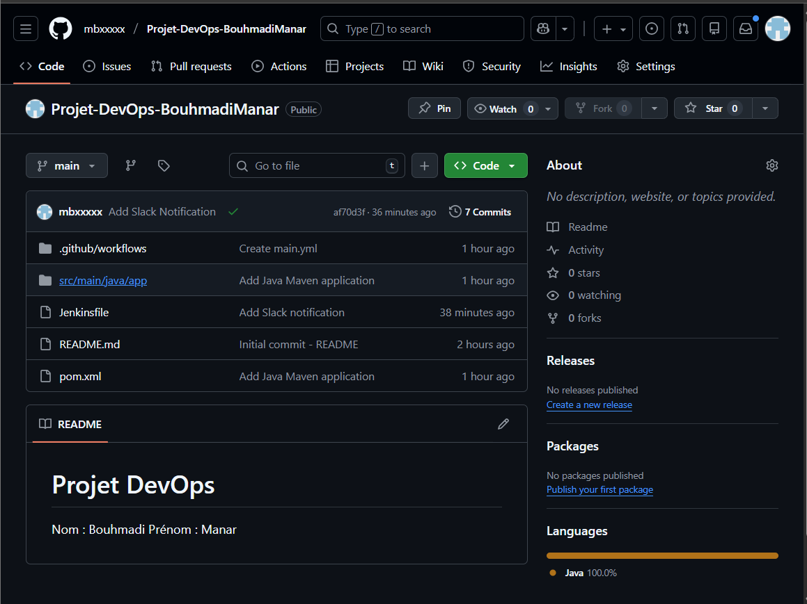
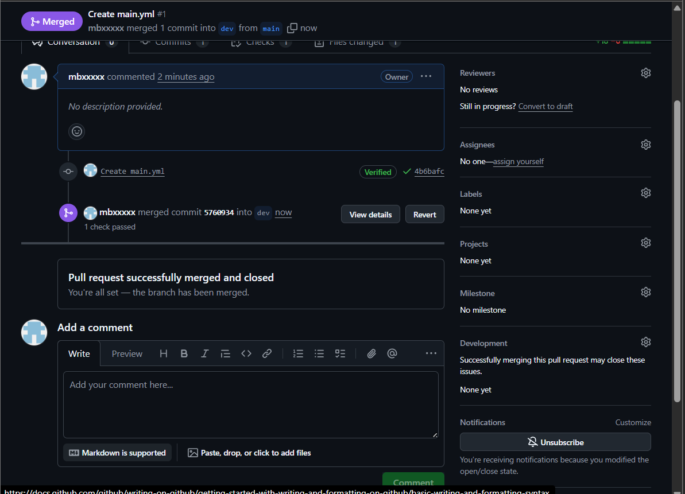
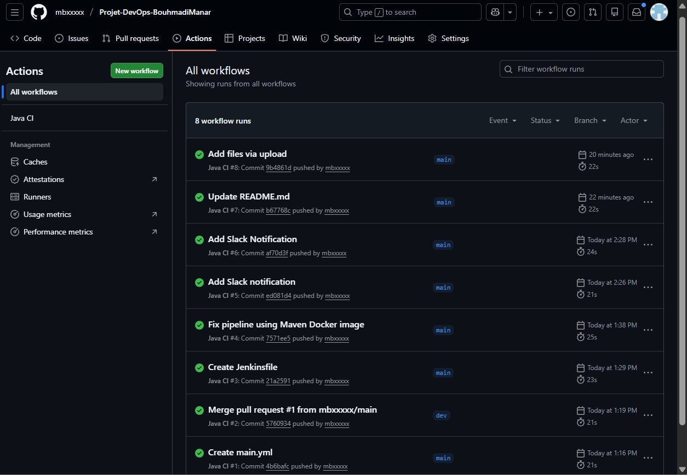
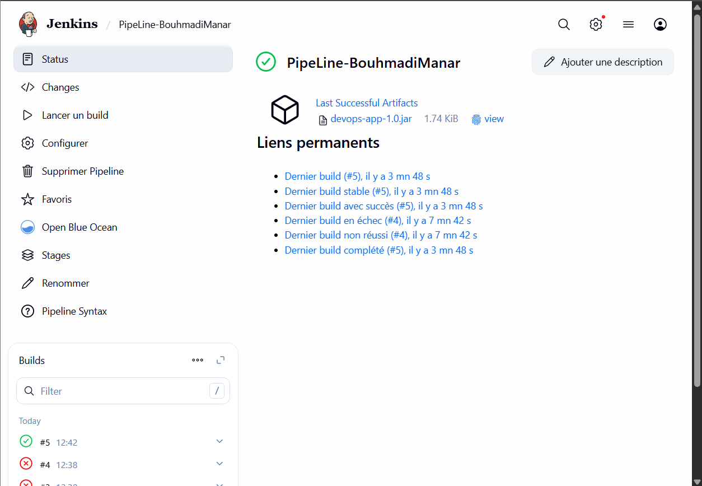
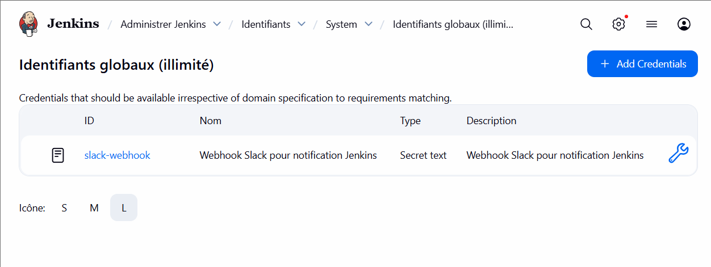
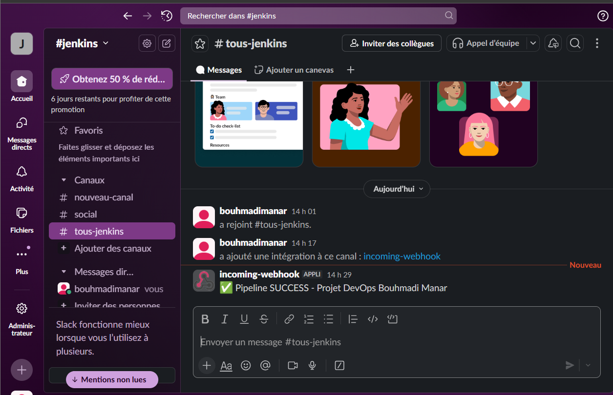

# Mini Projet DevOps  
## pour plus de details - voir rapport
##  Étudiant
- Nom : Bouhmadi
- Prénom : Manar

##  Objectif
Mise en place d’une chaîne CI/CD complète en utilisant :
Git, GitHub, GitHub Actions, Jenkins, Docker et Slack.

---

## Technologies

Git & GitHub - Gestion de version
GitHub Actions - Intégration continue
Java 17 & Maven - Application et build
Jenkins - Pipeline CI/CD
Docker - Containerisation
Slack - Notifications

---

##  Structure du projet

---

### Pull Request

---

##  GitHub Actions
Workflow CI déclenché sur push et pull request.

---

##  Jenkins Pipeline
Pipeline Jenkins avec les étapes :
- Checkout
- Build
- Test
- Archive

Type : Pipeline
Nom : PipeLine-BouhmadiManar
Script : Jenkinsfile (depuis GitHub)
Build automatique sur push/PR
Tests Maven
---

##  Slack Notification
Notification automatique après succès du pipeline.

---

##  Résultat 
Le pipeline CI/CD fonctionne correctement :
- Build réussi
- Tests validés
- Archive générée
- Notification Slack envoyée

## Documentation
Voir le rapport complet pour plus de détails et captures d'écran.

Manar BOUHMADI - Mini Projet DevOps
